# Review completo do site público: design, bugs, alinhamento, performance e imagens com IA

**Data:** 28/09/2026. **Código revisado:** `main` @ `9c1a1b0` ("ajustado transições"), que é o que está em produção.

**Como foi feito**
- O site rodou localmente com um banco simulado. O Supabase real está pausado (seção 0).
- Os dados simulados são os 4 anúncios que aparecem em `docs/redesign/before/`, mais 5 anúncios de teste com fotos.
- Tudo foi testado com Playwright em 390px (celular), 768px (tablet) e 1440px (desktop).
- Quatro subagentes trabalharam em paralelo:
  - design, usando a régua da skill `higgsfield-websites` (`review-rubric.md`, `design-recipe.md`, `design-taste-frontend.md`, `wow-catalog.md`);
  - QA funcional no navegador;
  - performance, com build de produção;
  - plano de imagens e vídeos com IA, usando a skill `higgsfield-generate`.
- **A pedido do dono, os princípios gravados em `CLAUDE.md`, `PRODUCT.md`, `DESIGN.md` e `docs/REDESIGN-*.md` foram ignorados de propósito.** O critério foi um só: o site precisa ser chamativo, fácil de ler e deixar o cliente achar o imóvel em segundos.

**Sobre as capturas:** ficam em `docs/review/2026-09-28/`. As fotos de casa que aparecem nelas são **fotos de teste recortadas da foto do hero**, não são dos imóveis. O botão "N" no canto é do modo de desenvolvimento do Next e não aparece em produção.

---

## Resumo em 30 segundos

1. **O site em produção está fora do ar desde 21/09.** O banco (Supabase) foi pausado e toda página que lista imóveis dá erro.
2. **A busca esconde imóveis.** Mexer em qualquer filtro tira da lista todos os lotes, galpões e salas comerciais. O preço máximo não pode ser alcançado. "Comprar" não funciona no desktop.
3. **Achar um imóvel é lento.** No celular, o 1º imóvel da Home fica a 2 telas de rolagem. Em `/imoveis`, a 1ª tela inteira é filtro, sem nenhum imóvel.
4. **O visual é tímido, não chamativo.**
   - a foto do topo é borrada (738×369 px esticada para 1440);
   - as cores da marca (vermelho e marinho) quase não aparecem;
   - a fonte serifada é de revista, não de vitrine;
   - o texto branco do botão de WhatsApp é quase ilegível (contraste 1,98:1).
5. **A simetria não foi corrigida.** Medimos 14 problemas de alinhamento e ritmo. A correção pedida antes existe no branch `worktree-symmetry-alignment`, **nunca foi mesclada** e resolve só 5 deles.
6. **Imagens com IA:** em 10/09 foram gerados 4 rascunhos (Z Image), que nunca entraram no site. A conta Higgsfield tem **9,4 créditos no plano gratuito**. Segundo a Higgsfield, esse plano tem marca d'água e não permite uso comercial; não confirmamos direto.
7. **Performance (celular em 4G lento):**
   - o título do hero e o preço da ficha só aparecem após **~5,5 s**, porque as animações os escondem até o JavaScript carregar;
   - até a página mais simples carrega **~200 KB de JS**;
   - vídeos servidos direto do Supabase gratuito vão estourar a cota de tráfego;
   - **com o banco fora do ar, nem é possível publicar uma correção**, porque o build falha.

---

## ✅ Status em 28/09 (depois do review): o que já foi feito

O dono respondeu às perguntas assim:
- **Supabase:** já restaurado.
- **Começar por:** bugs + alinhamento **e** redesign da Home e da busca.
- **Imagens com IA:** validar com os créditos grátis.
- **Visual:** mudar com força.

O que foi implementado no branch `claude/jolly-mayer-s0in5s`:

**Bugs**
- Os itens 1 a 18 da seção 1 estão corrigidos.
- A busca da Home tem botão "Buscar" e não muda de página no meio da digitação.
- A URL só leva os filtros escolhidos; os parâmetros inválidos não derrubam mais a página.
- A ficha não fica em branco com "reduzir movimento", porque as animações agora são só CSS.
- A galeria mostra todas as fotos.
- Existem páginas 404 e de erro em português.
- O build funciona com o banco fora do ar.

**Alinhamento**
- O branch `worktree-symmetry-alignment` foi mesclado.
- Container e ritmo únicos: medido de novo, todos os blocos ficam em 152–1288px a 1440px e em 24–744px a 768px.
- As grades não deixam mais card órfão.

**Redesign**
- **Home nova:** hero marinho com busca, atalhos por tipo com contagem, vitrines por finalidade, bairros com contagem, faixa vermelha de "Anunciar" e bloco de confiança.
- **Card novo:** preço em destaque e características com palavra.
- **`/imoveis` nova:**
  - filtros na lateral no desktop e em painel no celular;
  - 4–5 imóveis na 1ª tela do celular (antes, 0);
  - ordenação, paginação e chips de filtro.
- **Ficha nova:** preço logo abaixo do título no celular, características, "Sobre o imóvel", situação e imóveis parecidos.

**Identidade visual**
- Outfit + Instrument Sans com escala fluida; corpo de 17px.
- Fundo neutro; marinho e vermelho da marca como base.
- Contraste AA: WhatsApp `#1a7f43` e cinza de legenda `#666c7a`.
- Um sistema de botões só (alturas de 40, 48 e 56px).

**Performance** (build de produção no celular, mesma medição da seção 6)

| Página | JS antes | JS agora |
|---|---|---|
| `/empresa` | 199 KB | 154 KB |
| Home | 242 KB | 158 KB |
| `/imoveis` | 245 KB | 163 KB |
| Ficha | 249 KB | 158 KB |
| `/contato` | 296 KB | 251 KB |

- Fontes: de 110 KB para 61 KB.
- Saíram 6 dependências: motion, @base-ui, embla, cn, class-variance-authority e tw-animate-css.

**Imagens com IA**
- 24 rascunhos Z Image foram gerados, com **3,6 créditos** (saldo 9,4 → 5,8):
  - 8 de hero em 16:9;
  - 4 de hero em 3:4;
  - 8 ilustrações por tipo;
  - 2 de estado vazio;
  - 2 para a página Empresa.
- O dono aprovou as imagens e deixou a escolha em aberto (ver "2ª rodada" abaixo). Como a rede daqui bloqueia a CDN da Higgsfield, os arquivos vieram pelo sandbox da Higgsfield, conferidos por hash. Nenhum tinha marca d'água.

**Depois (capturas com os 6 anúncios reais):**
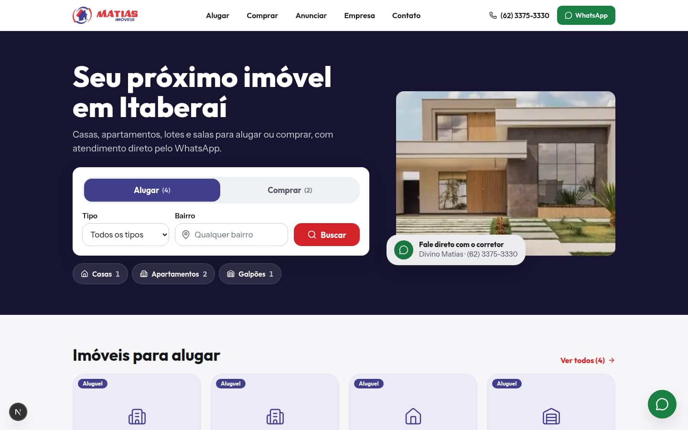
 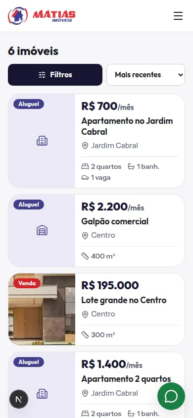 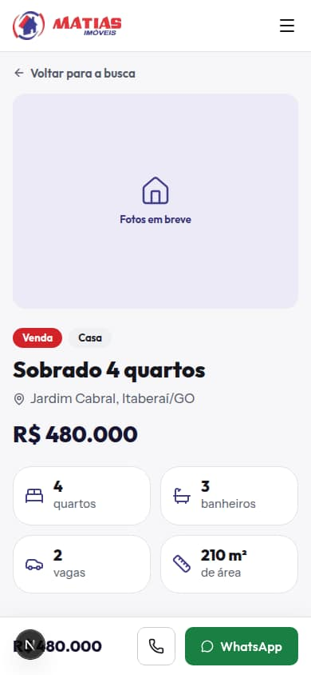
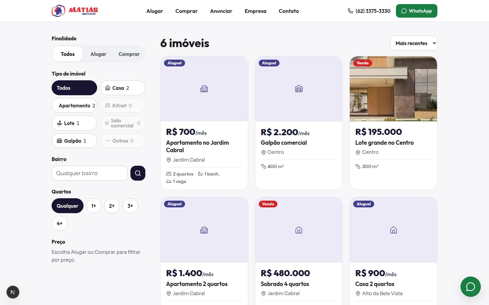
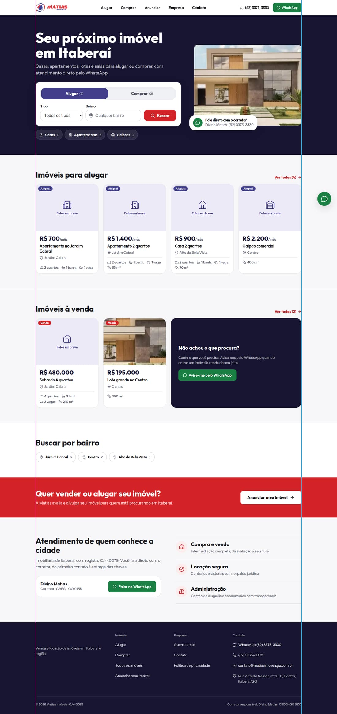

**2ª rodada (28/09, tarde): fotos reais, imagens de IA e "Foto pendente"**

O dono aprovou as imagens, mandou duas fotos da fachada e pediu que os lugares de foto ficassem marcados com "Foto pendente". Também decidiu ficar só na Vercel por enquanto. O que foi feito:
- O trabalho anterior foi para a `main` como um commit do dono, sem co-autor. O deploy de produção na Vercel ficou pronto.
- **Fachada real** no hero da Home, no topo da Empresa e no Contato ("Nossa fachada", para reconhecer a loja na rua). A foto de banco `hero-house.webp` saiu do site.
- **Imagens de IA escolhidas:**
  - ilustrações por tipo (casa, apartamento, kitnet, lote, sala, galpão) no quadro "Fotos em breve" dos anúncios sem foto;
  - lupa com mapa na busca sem resultado e nas páginas 404/erro;
  - a rua com ipê na faixa do "Anuncie", marcada "Imagem ilustrativa".
  Os outros rascunhos (ruas e vistas aéreas genéricas, variações das ilustrações e silhuetas da cidade) ficaram de fora: com a fachada real no hero, não havia lugar honesto para eles.
- **Foto pendente:**
  - foto de cada corretor na Home, na ficha e na nova seção "Nossa equipe" da Empresa, lida do cadastro em Admin → Corretores (na data, só a Ana Paula tinha foto);
  - foto do atendimento no escritório, na Empresa.
- `SITE.url` passou a ser `https://site-matiasimoveis.vercel.app`: os links de imóvel nas mensagens de WhatsApp, o sitemap e o Open Graph apontavam para o domínio próprio, que não está ligado a este site.

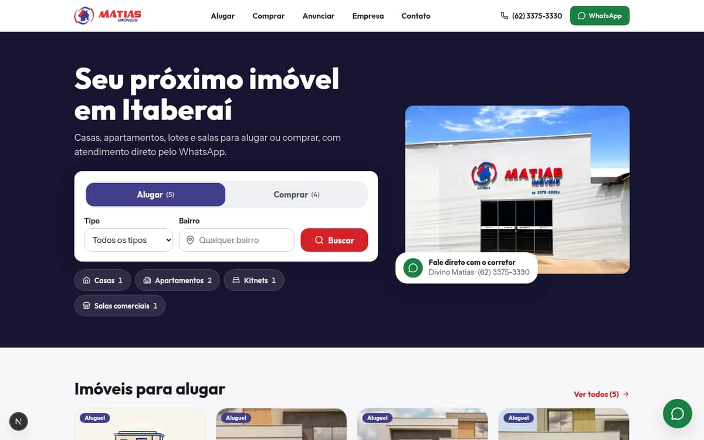
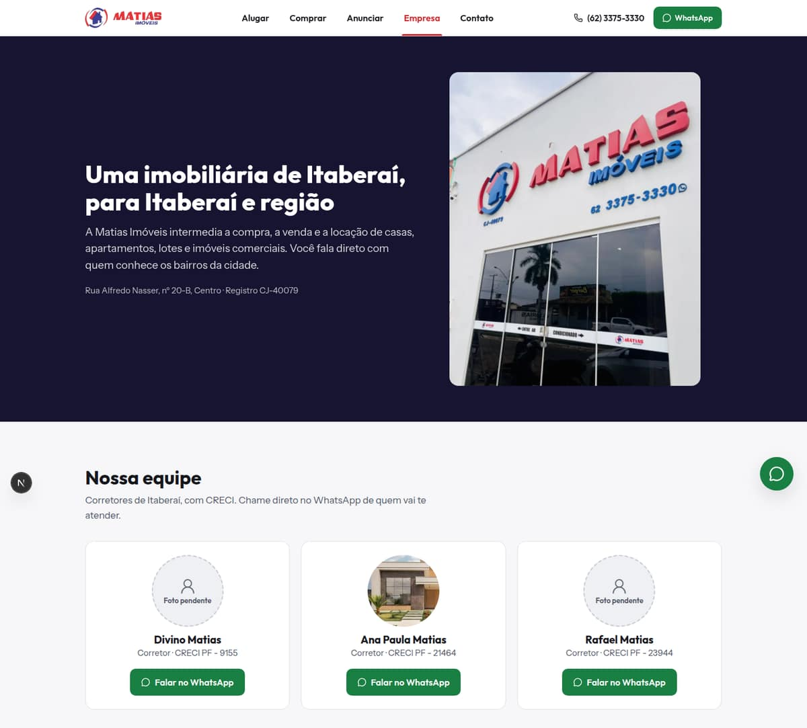
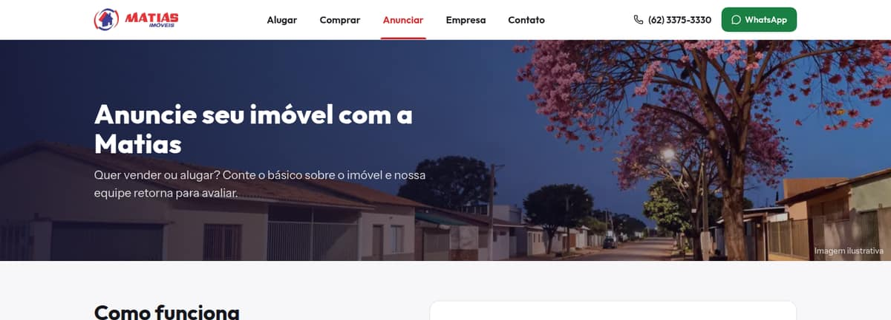
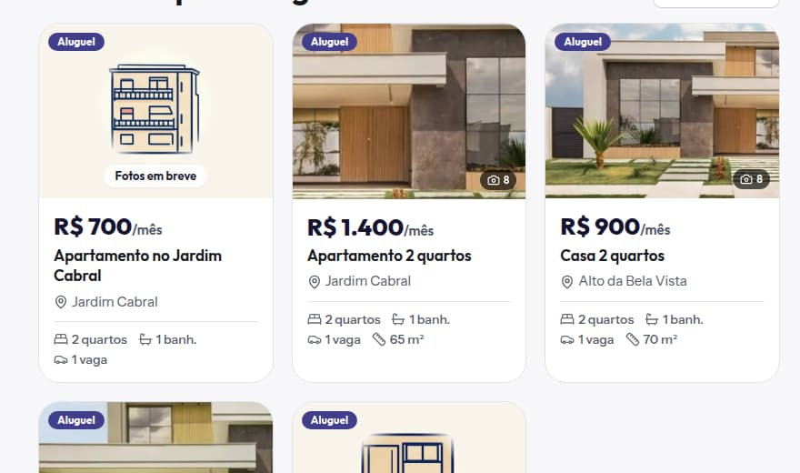

**Ainda pendente**
- **Decisões do dono:** domínio (0.2); plano da Vercel e prevenção de pausa do Supabase; fotos que faltam (corretores, escritório); formato do CRECI (o site usa "CRECI-GO 9155" e o cadastro usa "CRECI PF - 9155"); se o e-mail `contato@matiasimoveisgo.com.br` já recebe mensagens.
- **Código:**
  - logos em SVG;
  - `/contato` ainda com ~250 KB de JS (zod + react-hook-form);
  - pipeline de upload (fontes de 2048–2560px, `cacheControl`);
  - vídeos por streaming;
  - região `gru1` nas functions.

---

## 0. Urgente (antes de qualquer design)

### 0.1 Produção fora do ar: Supabase pausado
- **Situação:** o projeto `oaztinevexlzbpyuizfx` ("Site Matias Imóveis") está `INACTIVE`. O plano gratuito do Supabase pausa projetos parados.
- **Logs da Vercel (últimos 7 dias):** mais de 165 erros `getaddrinfo ENOTFOUND oaztinevexlzbpyuizfx.supabase.co` em `/`, `/imoveis` e em todas as fichas `/imovel/*`. O primeiro foi em 21/09 às 17:59 e o último hoje às 11:36 (UTC).
- **Efeito:** `/imoveis` é renderizada a cada acesso, então **qualquer busca, inclusive clicar em "Comprar", cai em erro**.
- **Não existe `error.tsx`:** o visitante vê a tela de erro genérica do Next.
- **Enquanto o banco estiver pausado, nenhuma correção pode ser publicada:** o `next build` falha em `generateStaticParams` (teste na seção 6).
- **Ação:**
  - restaurar o projeto no painel do Supabase;
  - decidir como evitar nova pausa (plano Pro, ou manter o projeto ativo);
  - criar `app/(site)/error.tsx` e `not-found.tsx` em português, com link para o WhatsApp.

### 0.2 Domínio oficial não conectado
- **Situação:** o único domínio ligado ao projeto na Vercel é `site-matiasimoveis.vercel.app`.
- **Problema:** o endereço oficial das páginas (canonical), o `sitemap.xml`, o `robots.txt` e as prévias de compartilhamento (Open Graph) apontam para `https://matiasimoveisgo.com.br` (`SITE.url` em `src/lib/site.ts`), que não está ligado a este projeto.
- **Risco:** se esse domínio ainda mostra o site antigo, o Google é instruído a indexar o site antigo.

### 0.3 A correção de alinhamento pedida está parada num branch
- **Situação:** o branch `worktree-symmetry-alignment` (commit `bc7a66c`, 9 arquivos) foi publicado como preview na Vercel em 22/09, mas nunca entrou no `main`. Ele mescla sem conflitos.
- **O que corrige:**
  - padding do rodapé e da página Empresa;
  - altura dos botões do hero;
  - formulário do Anuncie em 1 coluna no celular;
  - padding do textarea.
- **O que não corrige:** 9 dos 14 problemas medidos (seção 4).

---

## 1. Bugs funcionais

Legenda: 🔴 crítico, 🟠 alto, 🟡 médio. Todos foram **confirmados no navegador**, salvo quando indicado.

| # | Sev. | Problema | Causa (arquivo:linha) | Correção sugerida |
|---|---|---|---|---|
| 1 | 🔴 | **"Comprar" na Home não responde no desktop.** A `<section class="relative">` do hero é pintada por cima do card de busca, que sobe com margem negativa. A 1440px o botão fica 100% coberto; a 768px, 2/3; a 390px, o topo. [captura 01] | `src/app/(site)/page.tsx:22` + `:76` (`-mt-*`) | Card de busca com `relative z-10`, ou montar o card dentro do hero |
| 2 | 🔴 | **A busca da Home tira o usuário da página no meio da digitação.** Digitar "Jar" e pausar 0,5s leva a `/imoveis?bairro=Jar`; o foco se perde e o resto do texto some. Qualquer clique em Tipo/Alugar/Comprar também navega na hora, então não dá para montar dois filtros. | `SearchFilterBar.tsx:246-260` (auto-submit feito para `/imoveis`, reaproveitado na Home) | Na Home: formulário com botão **"Buscar"** explícito |
| 3 | 🔴 | **Os filtros escondem lotes, galpões e salas** *(confirmado com o banco simulado, em que esses imóveis têm quartos vazios; no banco real eles estão com quartos = 0, então hoje não somem por isso — mas o card mostrava "0 quartos")*. Os campos ocultos `quartos_min/max` e `preco_min/max` vão sempre na URL, e `lte("bedrooms", X)` exclui imóveis sem quartos. Resultados: `/imoveis` → Comprar mostra 2 de 4 imóveis à venda; Comprar + Lotes dá **0** (existe um lote à venda); Alugar + Comercial dá 0; na Home, clicar em "Lotes" dá 0. [captura 03] | `SearchFilterBar.tsx:143-144`, `queries.ts:194-195`, `computeRange` `queries.ts:137-156` | Só mandar `quartos_*`/`preco_*` quando o usuário mudar; no servidor, `bedrooms.is.null OR bedrooms.lte.X`; melhor ainda, trocar o slider de quartos por "1+ 2+ 3+" |
| 4 | 🔴 | **Em `/imoveis`, o filtro mostrado não é o aplicado.** Sem parâmetros, o toggle aparece em "Alugar" e o preço em "R$550–2.200/mês", mas a lista traz **os 9** imóveis, incluindo os de venda. Passar por um slider com Tab ou digitar no bairro aplica locação sem aviso (9 → 4). [captura 04] | `imoveis/page.tsx:49` (`purpose ?? "locacao"`), `SearchFilterBar.tsx:127,140` (`onBlur` envia o formulário) | Criar o estado "Todos" no toggle; enviar só quando o valor mudar |
| 5 | 🟠 | **O preço máximo de aluguel não pode ser escolhido.** Com `step=100` e intervalo 550–2200, o controle para em 2150. A URL grava `preco_max=2150` e a sala de R$ 2.200 some. A bolinha fica fora do fim da barra. [captura 09] | `SearchFilterBar.tsx:389` + `computeRange` | Arredondar mínimo e máximo para múltiplos do passo, ou usar faixas prontas ("até R$ 1.000", …) |
| 6 | 🟠 | **Os sliders ignoram a URL.** Recarregar ou compartilhar um link com preço filtrado mostra a faixa cheia, e o clique seguinte amplia o filtro sem aviso. Como os limites sempre vão na URL, **links salvos "congelam"** e escondem imóveis novos acima do máximo antigo. | `SearchFilterBar.tsx:375,390` (`defaultLow={range.min…}`) | Iniciar os sliders pelos valores da URL; não gravar os limites (ver #3) |
| 7 | 🟠 | **Uma URL com `finalidade` inválida dá erro 500.** Exemplo: `/imoveis?finalidade=aluguel`. No Postgres real, `tipo` inválido ou `quartos_max=abc` também devem quebrar (só lemos o código). | `SearchFilterBar.tsx:209` (`ranges[purpose]` sem validação); não há `error.tsx` | Validar `finalidade`, `tipo` e números em `imoveis/page.tsx` |
| 8 | 🔴 | **Com "Reduzir movimento" ativo, a ficha do imóvel fica em branco.** A opção existe no iPhone e no Android, e é comum em quem tem mais idade. Título, descrição e características ficam com `opacity:0`, porque o servidor e o navegador renderizam árvores diferentes (erro de hidratação). Mesmo sem essa opção, o HTML chega com o conteúdo invisível até o JavaScript carregar. [captura 02] | `components/motion/{FadeInOnMount,FadeInWhenVisible,HeroReveal}.tsx` (`useReducedMotion()` é `null` no servidor) | Animação só com CSS (`@media (prefers-reduced-motion)`), ou `MotionConfig reducedMotion="user"` sem trocar a árvore; nunca `opacity:0` no HTML do servidor |
| 9 | 🟠 | **A ficha no celular rola para o lado.** A linha "quartos · banheiros · vagas · área" soma 399px num espaço de 358: "210m²" fica cortado, "4 / quartos" quebra em duas linhas e o **botão WhatsApp da barra fixa termina fora da tela**. Acontece em todo imóvel com os 4 dados. [captura 06] | `imovel/[slug]/page.tsx:197-199` (`flex gap-7` sem `flex-wrap`) | Grade 2×2 no celular, número grande em cima do rótulo |
| 10 | 🟠 | **Galeria:** num imóvel com 12 fotos, **só 5 podem ser vistas**. Um lote com 2 fotos mostra 3 quadros falsos de "Foto em breve". No celular, as setas da foto ampliada ficam fora da tela. Ao abrir, as setas do teclado não funcionam. Não há contador de fotos. A capa se repete quando nenhuma foto foi marcada como capa (só lemos o código). [captura 10] | `ImovelGallery.tsx:33` (`slice(0,4)`), `:58` (4 miniaturas fixas), `ui/carousel.tsx:197,226` | Galeria com todas as fotos, contador "3/12", setas dentro da foto, miniaturas só das fotos que existem |
| 11 | 🟠 | **Filtro "Tipo" inconsistente.** O Sobrado não entra em "Residencial" nem em "Casa" (só aparece em "Todos"). "Lotes" e "Lote" coexistem e fazem a mesma coisa. "Outros" não tem categoria. Os botões não mostram contagem e alguns dão 0 resultado. | `lib/imovel-kind-categories.ts:13-15` | Uma linha só de tipos, com contagem ("Casas (12)"), desabilitando os que têm 0 |
| 12 | 🟡 | O slider **trava** quando as duas bolinhas se encontram no máximo. A bolinha tem 20px, menos que o alvo de toque de 44px. | `SearchFilterBar.tsx:137` | Ver #3 e #5: trocar por opções prontas |
| 13 | 🟡 | **Página 404 crua e em inglês.** Em `/qualquer-coisa` ela aparece até sem menu e rodapé; em `/imovel/nao-existe`, com o texto "This page could not be found." [captura 11] | Não há `not-found.tsx` | 404 em português, com busca, imóveis recentes e WhatsApp |
| 14 | 🟡 | **Anuncie:** "Finalidade" e "Tipo" já chegam preenchidos com "Vender" e "Casa", então quem quer alugar um lote envia errado sem perceber. O telefone aceita "abcdefgh". Os campos não têm `type="tel"`/`autocomplete`. | `ui/Select.tsx:73-75,202-203`, `forms/SellForm.tsx` | Opção vazia "Escolha…" obrigatória; validação e máscara de telefone |
| 15 | 🟡 | **Contato:** telefone e WhatsApp são texto, não link. O formulário pede e-mail mas envia pelo WhatsApp e não pede telefone. O botão "Enviar mensagem" sugere e-mail. O e-mail da empresa não aparece em nenhuma página. | `contato/page.tsx:37-44`, `forms/ContactForm.tsx` | Links `tel:` e WhatsApp; formulário = nome + telefone + mensagem |
| 16 | 🟡 | **A ficha omite dados que o corretor cadastra:** características (Piscina, Área gourmet…), área do terreno, situação (em negociação, vendido) e vaga só de moto (aparece ícone de carro). A descrição perde os parágrafos. Área vazia aparece como **"0m²"** no card, na ficha e no JSON-LD. No celular, o corretor não aparece e o preço só existe na barra fixa. | `imovel/[slug]/page.tsx:197-226,252`; `queries.ts:49` (`?? 0`); `format.ts:15` | Seção "Características" com os itens; selo "Em negociação"/"Vendido"; `whitespace-pre-line`; esconder a área quando for nula |
| 17 | 🟡 | "Voltar para a busca" perde os filtros. | `imovel/[slug]/page.tsx:167` (link fixo `/imoveis`) | `router.back()`, ou guardar a última busca |
| 18 | 🟡 | A barra fixa de preço no celular cobre o rodapé. | `ImovelMobilePriceBar.tsx` | Espaço inferior no rodapé igual à altura da barra |
| 19 | 🟡 | *(Só código)* `window.open` do WhatsApp roda depois da validação assíncrona dos formulários, e o Safari do iPhone pode bloqueá-lo como pop-up. Não há plano B. | `forms/SellForm.tsx`, `forms/ContactForm.tsx` | Abrir por um `<a href>` gerado, ou mostrar o link após enviar |
| 20 | 🟡 | *(Só código)* O filtro de bairro diferencia acento: "ipes" dá 0 e "ipês" dá 1. `%` e `_` digitados viram coringa. | `queries.ts:190` | Busca sem acento (`unaccent`) e escapar os coringas |
| 21 | 🟡 | *(Só código)* Imóveis vendidos ou alugados continuam na busca, sem selo. | `queries.ts` | Filtrar ou marcar com selo |

---

## 2. "Achar o imóvel em segundos": onde o site falha hoje

**Medições**

| Onde | Onde está o 1º imóvel | Altura da tela |
|---|---|---|
| Home, celular | y = 1688px | 844px |
| Home, desktop | y = 1225px | 900px |
| `/imoveis`, celular | y = 865–881px | 844px |

Em `/imoveis` no celular, o filtro ocupa 676px com 5 linhas de botões [captura 05].

**O que atrapalha**
- **Filtro "Tipo" com 12 opções em 2 níveis redundantes.** "Residencial" já contém Casa, Kitnet e Apartamento; "Lotes" e "Lote" repetem.
- **Sliders são ruins para preço e quartos.** São imprecisos no toque e ficam escondidos atrás de bugs (#3, #5, #6, #12). Quem procura imóvel pensa em faixas: "até R$ 1.000/mês", "2+ quartos".
- **Não há ordenação** ("menor preço", "mais recentes") **nem paginação.** Também não há contagem por tipo nem por bairro.
- **No card:**
  - os ícones "2 1 1" não têm legenda;
  - o preço está em preto, sem destaque;
  - "Ref.: 7" é informação do corretor, não do cliente;
  - o título repete o bairro;
  - no celular, cada card tem 426px de altura, e cabem só 2 por tela.
- **Na Home**, o destaque são dados de cartório ("CJ-40079 / CRECI-GO 9155 / Itaberaí/GO"), no lugar em que deveriam estar atalhos como "Casas (12) · Lotes (8)".

### Proposta de nova Home (wireframe)

```
[HEADER 64px] logo | Alugar  Comprar  Anunciar  Empresa | (62) 3375-3330  [WhatsApp]

[HERO-BUSCA · faixa marinho; foto real grande (ou ilustração IA) à direita no desktop]
  H1 curto: "Seu imóvel em Itaberaí"
  [ ALUGAR | COMPRAR ]            toggle grande (56px), largura total no celular
  [ Bairro ou tipo … ] [ BUSCAR ] botão vermelho, envio explícito
  Atalhos com contagem (rolagem lateral no celular):
  [Casas 12] [Apartamentos 5] [Lotes 8] [Comercial 3] [Kitnets 2]

[NOVIDADES] abas: Para alugar | À venda
  celular: carrossel com o próximo card aparecendo · desktop: 4 colunas × 2 linhas (8 cards, sem órfão)
  [ Ver todos os 23 imóveis → ]  botão largo

[ATALHOS] faixas de preço (mudam com a aba) · bairros com contagem

[FAIXA VERMELHA, largura total] "Quer vender ou alugar seu imóvel?"  [Anunciar meu imóvel]

[CONFIANÇA] foto real do Divino + nome + CRECI + [WhatsApp] | 3 serviços | mini-mapa

[FOOTER] 4 colunas (2×2 no celular), no mesmo alinhamento do resto · telefone, WhatsApp, e-mail, horário, CJ
Celular: barra fixa inferior [Filtros] [WhatsApp], no lugar do botão flutuante
```

### Proposta de card

```
┌──────────────────────────────┐
│ FOTO 4:3        [📷 8]       │  foto limpa, contador discreto
├──────────────────────────────┤
│ R$ 1.400/mês        ALUGUEL  │  preço 26–28px em negrito, na cor da marca
│ Casa · 2 quartos             │  o que o cliente lê primeiro
│ Jardim Cabral                │
│ 2 quartos · 1 banh. · 1 vaga · 65 m² │  ícone + número + palavra; esconder zeros
│ [ Ver imóvel ]  [ WhatsApp ] │
└──────────────────────────────┘
```

Em `/imoveis`, no celular: filtros recolhidos num botão fixo **"Filtros (2)"** e cards em lista horizontal (foto à esquerda, ~150px de altura). Assim cabem 4–5 imóveis por tela; hoje cabem 2.

---

## 3. Visual: por que o site não é chamativo

**Notas pela régua da skill `higgsfield-websites`**

| Critério | Nota | Motivo |
|---|---|---|
| Clareza da proposta / hero | 4/10 | Frase genérica; "CJ-40079" no topo; o botão "Buscar imóveis" repete o card logo abaixo; foto borrada |
| Velocidade para achar o imóvel | 2/10 | Seção 2 |
| Hierarquia e tipografia | 4/10 | Serifada de revista; tamanhos fixos sem escala para celular; botões com duas fontes |
| Cor e marca | 4/10 | O vermelho e o marinho do logo quase não aparecem acima do rodapé; o resto é creme, branco e cinza |
| Layout, simetria e ritmo | 3/10 | Seção 4 |
| Cards e densidade | 5/10 | Boa foto 4:3, mas preço apagado, ícones sem legenda, "Ref." e "0m²" à vista |
| Botões de ação | 3/10 | 4 textos e 3 estilos para a mesma ação (WhatsApp); contraste 1,98:1 |
| Imagens | 3/10 | Hero 738×369 esticado; página Empresa sem nenhuma foto |
| Celular | 3/10 | Rolagem lateral na ficha; filtro de 676px; títulos quebrando |

**Principais pontos visuais**

1. **A foto do topo tem 738×369px** e é exibida a 1440×520 ou mais: borrada em qualquer tela boa [captura 12]. Também é uma casa genérica de banco de imagens, que não lembra Itaberaí.
2. **A marca some.** O marinho só aparece no toggle, nos selos e no rodapé; o vermelho, no link ativo e no texto de um botão.
   - **Proposta:** marinho como cor de fundo das faixas principais (hero, busca, faixas de chamada) e vermelho como **única** cor de ação ("Buscar", "Anunciar").
3. **Tipografia.**
   - **Hoje:**
     - Fraunces (serifada editorial) com Instrument Sans;
     - **tamanhos fixos em px, sem escala no celular** (`src/styles/tokens/typography.css`): o título da Home ocupa 3 linhas e o da Empresa 4, a 390px;
     - "Imóveis em destaque" e "Ver todos" quebram em 2 linhas;
     - os botões misturam as duas fontes (hero em serifada com 42px, `Button` em sans com 46px, `Button lg` em serifada de 22px).
   - **Proposta:**
     - uma sans forte para títulos e preços (por exemplo Outfit 700/800, ou manter só a Instrument Sans em pesos altos);
     - números tabulares nos preços;
     - `clamp()` nos tamanhos (título 34→56px);
     - corpo de 17px (o público é mais velho).
4. **Contraste reprovado:**
   - botão de WhatsApp com texto branco sobre `#25d366`: **1,98:1** (mínimo 4,5:1). Usar verde `#1a7f43` (5,05:1) ou texto escuro;
   - cinza de legenda `--text-3` `#9ea4b0`: **2,2–2,5:1** ("Foto em breve", legendas da Home, "Corretor responsável").
5. **Faixa de confiança com jargão.** "CJ-40079 · CRECI-GO 9155" não diz nada ao cliente; o lugar dela é no rodapé ou no "Sobre". Os serviços usam numeração "01/02/03", marca típica de template.
6. **Página Empresa:**
   - nenhuma foto, e metade direita do topo vazia;
   - o card "Corretor responsável" é fraco;
   - os mesmos 3 serviços da Home aparecem com outro visual (ícones centralizados na Empresa, "01/02/03" na Home).
7. **Ficha no desktop:** a coluna direita fica vazia depois do quadro de preço. Faltam mapa, "imóveis parecidos" e compartilhar.
8. **Logos em PNG** (100–225 KB cada), com "CJ-40079" embutido e ilegível sob o ícone da navbar. O ideal é SVG vetorizado; um trace local resolve sem custo.
9. **Faltam** `apple-icon`, `manifest` e `theme-color`: o ícone não aparece ao salvar o site na tela inicial do celular.

---

## 4. Simetria e alinhamento (medido, não estimado)

Referência: a borda esquerda do logo e a borda direita do último item da navbar.

| Largura | Esquerda | Direita |
|---|---|---|
| 390px | 16 | 374 |
| 768px | 24 | 744 |
| 1440px | 152 | 1288 |

Linhas-guia nas capturas 07 e 08.

| Página@largura | Bloco | Medido | Desvio | O branch `worktree-symmetry-alignment` corrige? |
|---|---|---|---|---|
| Home@1440 | Card de busca | 272 / 1168 | +120 / −120 (`!max-w-[960px]`) | ❌ |
| Home@1440 | Faixa CJ/CRECI/Itaberaí | centralizada (469–971) numa página alinhada à esquerda | outro eixo | ❌ |
| Home@1440 | Destaques → Serviços | espaço de **0px** (o card encosta na borda); acima são 120–136px | ritmo | ❌ |
| Home@1440 | Grade de destaques | 4 cards em 3 colunas → [3,1] | card órfão | ❌ |
| Home@390 | "Ver todos" / título | quebram em 2 linhas | — | ❌ |
| Home@390 | Faixa CJ/CRECI | 2 + 1 | órfão | ❌ |
| Rodapé@1440 | Colunas | 120 / 1320 | −32 / +32 | ✅ |
| Rodapé@768 e @390 | Colunas | 32 / 736 e 32 / 358; "Seu imóvel" sozinho numa linha | ±8 / ±16, órfão | ✅ (alinhamento) |
| Empresa@1440 | Hero e serviços | 120 / 1320, e a seção do meio em 152 | −32 | ✅ |
| Empresa@390 | Hero e serviços | 32 / 358 | +16 | ✅ |
| Anuncie e Privacidade@768 | Título e formulário | 48 / 720 | +24 / −24 | ❌ |
| Ficha@390 | Linha de características | borda direita em 415 | 25px de rolagem lateral | ❌ |
| `/imoveis`@768 | Grade de 9 cards | [2,2,2,2,1] | órfão | ❌ |
| Hero@todas | Botões lado a lado | 42px, fonte serifada (os outros botões têm 46px e fonte sans) | — | ✅ (altura) |

**Parecer:** vale mesclar o branch, mas ele cobre cerca de 1/3 do problema. A correção de fundo é:
- **um container único** para todas as seções;
- **um ritmo vertical único** (por exemplo `py-16 lg:py-24` em toda seção);
- **grades com quantidade múltipla das colunas.**

---

## 5. Inconsistências

- **WhatsApp:**
  - 4 textos para a mesma ação: "Falar no WhatsApp", "Falar no WhatsApp agora", "WhatsApp" e "Enviar mensagem" (que também abre o WhatsApp);
  - 3 sistemas de botão (hero feito à mão, `Button`, `WhatsAppLink`).
- **Serviços:** um visual na Home, outro na Empresa.
- **Preço:** "R$550" no slider e "R$ 700" no card (com e sem espaço).
- **Contato:** o formulário pede e-mail mas envia por WhatsApp.
- **Largura das páginas:** `/anuncie` e `/privacidade` usam outra largura e outro padding.
- **Classes CSS:** dois helpers convivem, `cn` (em `ui/dialog`, `drawer`, `carousel`) e `clsx` (no resto). Por isso aparecem `!px-0` e `!max-w-[960px]` forçando valores.
- **Valores fora do sistema de design:** cores fixas (`#fff`, `text-neutral-*`, `bg-white`) e medidas soltas (`w-[18px]` ×7, `py-[11px]`, `px-[22px]`).
- **A classe `font-display`** no `Button` e na Navbar não tem efeito, porque o `font:` inline a sobrescreve.
- **Durante o carregamento** de uma nova busca, o título mantém a contagem antiga ao lado dos esqueletos dos cards.
- **Acessibilidade:**
  - o menu ativo não tem `aria-current`;
  - o menu lateral no celular não tem botão "fechar";
  - os textos da foto ampliada (lightbox) estão em inglês ("Previous slide", "Close");
  - alvos de toque pequenos: links do rodapé com 21px, telefone no menu com 35px.
- **Rodapé:** não tem telefone, WhatsApp, e-mail, horário nem redes sociais.

---

## 6. Performance e preparação para muita mídia

**Como foi medido**
- Build de produção (`next start`) de uma cópia do repo.
- Chromium com tela de celular 390×844, CPU 4x mais lenta e rede "Slow 4G" do Lighthouse (RTT 562 ms, 1,47 Mbps).
- Cache frio, mediana de 3 execuções.
- O servidor era local, sem DNS/TLS: em produção, espere LCP ~1–1,5 s pior. As fotos de teste comprimem melhor que foto real.

| Página | FCP | LCP (elemento) | TBT aprox. | Req. | Total | JS | Fontes | Imagens |
|---|---|---|---|---|---|---|---|---|
| `/` | 2,31 s | 2,52 s (foto do hero) | 604 ms | 32 | 737 KB | 341 KB | 110 KB | 244 KB |
| `/imoveis` | 1,94 s | 1,94 s (título; a grade começa invisível) | 572 ms | 33 | 700 KB | 260 KB | 110 KB | 287 KB |
| ficha (12 fotos) | 1,96 s | 2,25 s (foto principal) | 501 ms | 33 | 693 KB | 254 KB | 110 KB | 294 KB |
| `/empresa` (só texto) | 2,08 s | 2,08 s | 602 ms | 24 | 515 KB | 242 KB | 110 KB | 133 KB |
| `/contato` | 1,95 s | 1,95 s | **864 ms** | 26 | 612 KB | 339 KB | 110 KB | 133 KB |

CLS = 0 em todas.

**Conteúdo escondido pelas animações:** no 4G lento, o título e os botões do hero só ficam visíveis em **5,2–5,8 s**, e o título e o preço da ficha em **5,7–5,9 s**, porque dependem do JavaScript para sair do `opacity:0`. O LCP não acusa isso, porque o Chrome ignora elementos invisíveis.

**Tipo de renderização por rota:**
- `/`: ISR de 60 s.
- `/imoveis`: **dinâmica, roda a cada acesso** (o `revalidate = 60` não tem efeito).
- `/imovel/[slug]`: gerada no build, com ISR.
- Imagem de compartilhamento (OG) por imóvel: dinâmica.
- Demais páginas: estáticas.

**JS por rota (gzip):**

| Rota | JS |
|---|---|
| `/empresa` (base) | 199 KB |
| `/` | 242 KB |
| `/imoveis` | 245 KB |
| ficha | 249 KB |
| `/contato` | 296 KB |
| `/anuncie` | 298 KB |

O que pesa:
- **Em todas as páginas:** runtime React/Next ~132 KB e o menu mobile (Drawer do @base-ui) **~52 KB**.
- **Por página:**
  - `motion` (animações): ~43 KB;
  - `zod` + `react-hook-form` (formulários): ~99 KB;
  - carrossel + diálogo da galeria: ~10 KB.
- A Home ainda pré-carrega o pacote de validação do formulário, por causa do link "Anuncie seu imóvel" no hero.

### Achados

| Sev. | Achado | Evidência | Correção |
|---|---|---|---|
| 🔴 | As animações escondem conteúdo acima da dobra (ver bug #8) | `motion/*.tsx` mandam `opacity:0` no HTML do servidor: 7 blocos na Home, 3 na ficha, 1 em `/imoveis` | Animação só com CSS dentro de `@media (prefers-reduced-motion: no-preference)` (ou `animation-timeline: view()`); também tira ~43 KB de JS |
| 🔴 | **Com o Supabase fora do ar, nem dá para publicar correção:** o `next build` falha em `generateStaticParams` | Testado derrubando o banco simulado. `/imoveis` devolve 500 depois de ~7 s, com página em branco sem menu. As queries fazem `throw` (`lib/queries.ts:84,97,104,167,200`) | `error.tsx`/`global-error.tsx`/`not-found.tsx`; `generateStaticParams` com try/catch devolvendo `[]`; estado "catálogo indisponível"; resolver a pausa do Supabase |
| 🔴 | **Vídeos crus servidos do Supabase Free** vão estourar a cota de tráfego | O Free tem ~10 GB/mês de tráfego (5 GB com cache + 5 GB sem); um vídeo de celular de 40 MB visto ~125 vezes esgota isso. O `<video>` não tem `poster` nem dimensões. O `VideoManager.tsx:9` aceita 100 MB, mas o limite de upload do Free é 50 MB | Vídeo de imóvel em serviço de streaming (Mux, Cloudflare Stream, Bunny) ou YouTube não listado carregado no clique; loops decorativos de até ~2 MB, com poster |
| 🟠 | `/imoveis` não escala | Sem paginação. `IMOVEL_SELECT` traz todas as fotos, vídeos e o corretor de cada anúncio; com 9 anúncios, o HTML já leva 49 URLs de foto e 9 descrições inteiras (96 KB). `getImovelRanges` lê o catálogo inteiro a cada acesso | Select só com os campos do card + capa; paginação com `.range()`; faixas de preço/quartos por uma função SQL com min/max; cache (`'use cache'` + `cacheTag`); functions na região `gru1` (São Paulo), já que o padrão `iad1` fica longe do Supabase em `sa-east-1` |
| 🟠 | Tamanhos de imagem | As miniaturas de 72 px da ficha baixam a versão de ~1080 px (`sizes` padrão "280px", `ImovelPhoto.tsx:35`). O hero é ampliado ~4,6x no celular. O `priority` foi descontinuado no Next 16 | `sizes` corretos (miniatura 96 px); hero de 2400 px + recorte vertical para celular; `preload`/`fetchPriority` |
| 🟠 | Upload e cache das fotos | `image-compression.ts`: JPEG 1600 px com qualidade 0,82, sem guardar dimensões nem placeholder. O upload não define `cacheControl` (fica 1 h), e o Next reprocessa a imagem a cada 4 h. O `srcset` gera 10 larguras, até 3840 px | Fonte de 2048–2560 px; salvar largura, altura e placeholder no upload; `cacheControl: '31536000'`; `minimumCacheTTL` de 31 dias; menos larguras |
| 🟠 | Cotas e plano | O redimensionamento do Supabase só existe no plano Pro, então o otimizador da Vercel é o caminho. A cota do Hobby deve ser ~5 mil transformações/mês (**confira no painel**); 100 anúncios × 12 fotos × ~6 tamanhos ≈ 7 mil. **Pelos termos da Vercel, o plano Hobby é para uso não comercial** | Avaliar Vercel Pro para o site de uma empresa |
| 🟠 | JS e travamento | O menu mobile (Drawer do @base-ui) vai para todas as páginas, então até `/empresa` trava ~600 ms. O zod v4 completo nos formulários leva `/contato` a 864 ms | Menu com `<dialog>` nativo ou carregado só ao abrir; validação nativa ou `zod/mini`; `prefetch={false}` no link do Anuncie; galeria carregada sob demanda |
| 🟡 | Fontes | 110 KB em toda página. O itálico da Fraunces (45,6 KB) e o peso 300 não são usados | Remover (ou trocar a fonte; ver seção 3) |
| 🟡 | Favicon e logos | `icon.png` 512×512 com 98 KB (74% das imagens de `/empresa`); logos em PNG de 104–224 KB | Favicon pequeno + `apple-icon` de 180 px; logos em SVG |
| 🟡 | A imagem de compartilhamento de cada imóvel é regerada a cada acesso (`max-age=0`) | Cada prévia no WhatsApp re-renderiza a imagem e busca a capa no Supabase | Pré-gerar, ou usar a própria capa |

### Checklist antes de colocar mídia pesada
- [ ] Animações só em CSS, sem `opacity:0` vindo do servidor; bug de "reduzir movimento" corrigido.
- [ ] `error.tsx` e `not-found.tsx`; queries e `generateStaticParams` resistentes a falha; pausa do Supabase resolvida.
- [ ] Vídeo por serviço de streaming ou carregado no clique; loops de até 2 MB com `poster` e `aspect-ratio`; limite de upload de 50 MB.
- [ ] Fotos: fonte de 2048–2560 px, dimensões e placeholder salvos, cache de 1 ano, menos larguras no `srcset`, `sizes` corretos.
- [ ] `/imoveis` com select enxuto, paginação, faixas em cache, functions em `gru1`.
- [ ] Metas: até 170 KB de JS por rota; até 1 MB na primeira visita pelo celular; TBT até 200 ms; LCP até 2,5 s medido com TLS.
- [ ] Revisar as cotas (Vercel Hobby × uso comercial; Supabase Free: ~10 GB de tráfego e 1 GB de storage) e ligar alertas de uso.

---

## 7. Imagens e animações com IA (Higgsfield)

**O que aconteceu**
- Em 10/09/2026 foram gerados 4 rascunhos com **Z Image** (0,15 crédito cada, 2048×1152): uma rua do interior goiano, duas fachadas térreas e uma "família na varanda".
- **Nenhum entrou no site.** Dá para vê-los na conta Higgsfield; aqui não foi possível baixá-los, porque a rede desta sessão bloqueia o site da Higgsfield.
- Saldo atual: **9,4 créditos, plano Free.**
- Segundo a ajuda e a página de preços da Higgsfield, o plano Free **põe marca d'água e não inclui uso comercial**. Não confirmamos direto, porque o domínio é bloqueado aqui.
- Consequência: os créditos atuais servem para **validar a direção de arte**, não para produzir as imagens finais do site.

**Regras de honestidade** (não são "princípios de design", e sim risco legal de propaganda enganosa, CDC art. 37)
1. IA **nunca** na foto de um imóvel anunciado: card, galeria, ficha ou imagem de compartilhamento do imóvel.
2. Nada de pessoas geradas por IA apresentadas como equipe ou cliente.
3. Imagem fotorrealista de IA leva a legenda "Imagem ilustrativa" e não é rotulada como "Itaberaí".
4. O quadro "sem foto" usa ilustração em traço, nunca foto realista.
5. Uma foto **real** de Itaberaí, da fachada da imobiliária ou do corretor vence qualquer IA no hero e na Empresa.

**Direção de arte proposta**
- **Cenário:** rua residencial do interior goiano no fim da tarde, com casas térreas, muro baixo, portão de ferro, telha cerâmica, caixa d'água, ipê-amarelo, terra vermelha e morros de cerrado.
- **Evitar:** piscina, mansão de vidro, palmeiras.
- **Paleta:** creme `#faf7f2`, marinho `#161430`, índigo `#413e8c` e vermelho `#e6383d` só como acento.

| # | Onde entra | Formato | Modelo sugerido | Custo estimado | Prioridade |
|---|---|---|---|---|---|
| 1 | Hero da Home (desktop) | 21:9, exportado em 2560, 1920 e 1280 | Nano Banana Pro | ~12 cr | P1 |
| 2 | Hero da Home (celular) | 4:5 (1080×1350) | Nano Banana Pro | ~6 cr | P1 |
| 3 | "Sem foto" por tipo (casa, apto, kitnet, lote, comercial, galpão) + atalhos "Navegue por tipo" | ilustração vetorial 1:1 / 4:3 | Recraft V4.1 vector | ~12–24 cr | P1 |
| 4 | Ilustrações dos 3 serviços | 4:3 vetor | Recraft V4.1 | ~6–12 cr | P2 |
| 5 | Nenhum resultado / 404 | 1:1 vetor | Recraft V4.1 | ~3–4 cr | P2 |
| 6 | Loop de 5s no hero (só desktop) | 16:9, 720p, sem som | Kling 3.0 | ~10 cr | P2 |
| 7 | Anuncie (coluna ilustrada) | 3:2 / 16:9 | Recraft V4.1 | ~4–8 cr | P2 |
| 8 | Empresa (metade vazia do topo) | 4:5 / 16:9 | Recraft V4.1 ou NB Pro | ~8 cr | P2 |
| 9 | Imagem de compartilhamento padrão | 1200×630 | reaproveita o #1 com `next/og` | 0 | P2 |

Os prompts prontos (em inglês) estão no relatório do subagente, na conversa desta sessão. Só o custo do Z Image está confirmado (0,15 cr); os outros são estimativas.

**Com os 9,4 créditos atuais**
- ~25 rascunhos Z Image (3,75 cr) para travar composições e estilo;
- 2 testes com Nano Banana Pro no hero (~4 cr);
- não cabe vídeo com folga.

**Produção completa (P1 + P2):** ~100–120 créditos. O plano Plus custa US$ 49/mês por 1.000 créditos. Existe um teste de 3 dias com 100 créditos que **exige cartão e renova sozinho** se não for cancelado. Decisão do dono.

**Formato para a web**
- **Imagens:** AVIF/WebP via `next/image`, com versões diferentes para celular (4:5) e desktop (21:9). Metas: ≤250 KB no desktop e ≤120 KB no celular.
- **Ilustrações:** SVG.
- **"GIFs": nunca GIF.** Usar `<video autoplay muted loop playsinline>` em MP4 + WebM, com imagem de capa e botão de pausa.
  - O GIF tem 256 cores (o céu fica em faixas) e pesa 10–20 MB contra 1–2 MB do vídeo.
  - Com "reduzir movimento" ou em conexão lenta, mostrar só a imagem de capa.

---

## 8. Plano de ação sugerido

| Fase | O quê | Por quê |
|---|---|---|
| **0 (hoje)** | Restaurar o Supabase; decidir a prevenção de pausa; `error.tsx` e `not-found.tsx` em português; decidir o domínio | O site está fora do ar |
| **1 (bugs)** | Itens 1–11 da seção 1: "Comprar", busca da Home com botão, filtros que escondem imóveis, estado "Todos", sliders, erro 500, ficha em branco (animações), rolagem lateral, galeria, tipos | Hoje o site **esconde imóveis** e quebra |
| **2 (achar em segundos)** | Nova Home (seção 2), busca simplificada (tipo com contagem + faixas de preço + "2+ quartos"), filtros recolhidos no celular, novo card, ordenação e paginação, ficha completa (características, situação, mapa, parecidos) | Objetivo principal do dono |
| **3 (identidade chamativa)** | Container e ritmo únicos (inclui mesclar o branch de alinhamento), cor da marca como base, nova tipografia com escala para celular, contraste AA, logo em SVG, hero com foto real ou IA em alta resolução | "Chamativo e fácil de ler" |
| **4 (mídia)** | Seção 6 + pipeline de imagens e vídeos (seção 7), depois gerar os ativos com IA | Preparar para "diversos recursos visuais" |

---

## 9. Perguntas em aberto para o dono

1. **Supabase:** posso restaurar o projeto pausado? Prefere plano Pro (sem pausa) ou manter o gratuito com alguma rotina que evite a pausa?
2. **Domínio:** `matiasimoveisgo.com.br` é seu? Hoje ele mostra o site antigo? Vai apontar para a Vercel?
3. **Alugar ou Comprar:** qual é o carro-chefe do negócio? Isso decide o padrão da busca e a ordem das abas.
4. **Fotos reais:** existe foto da fachada da imobiliária, do Divino ou de Itaberaí (praça, igreja matriz) que possamos usar? Uma foto real vence a IA no hero.
5. **IA:** quer (a) só validar a direção de arte com os 9,4 créditos gratuitos, ou (b) assinar um plano pago para gerar os ativos finais?
6. **Tipografia e cor:** aceita trocar a Fraunces (serifada) por uma sans forte e usar o marinho e o vermelho do logo com muito mais presença?
7. **Por onde começar:** posso já mesclar o branch `worktree-symmetry-alignment` e corrigir os bugs da Fase 1, antes do redesign?
8. **Hospedagem:** o projeto está no plano Hobby da Vercel, que pelos termos da Vercel é para uso não comercial. Vale migrar para o Pro antes de colocar muita mídia?
9. **Vídeos de imóveis:** o corretor vai subir vídeos com frequência? Se sim, prefere um serviço de streaming pago (Mux ou Cloudflare Stream, alguns dólares por mês) ou YouTube não listado (grátis)?

---

## Capturas de evidência

| # | O que mostra |
|---|---|
| 01 | 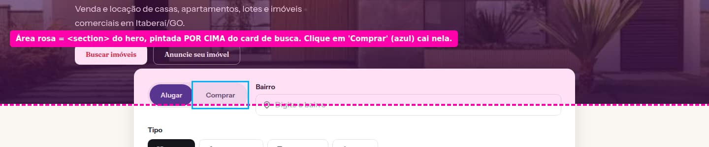 Área rosa = a `<section>` do hero, que fica por cima do card; o clique em "Comprar" (azul) cai nela |
| 02 |  Ficha no celular com "Reduzir movimento": abaixo das fotos, nada |
| 03 | 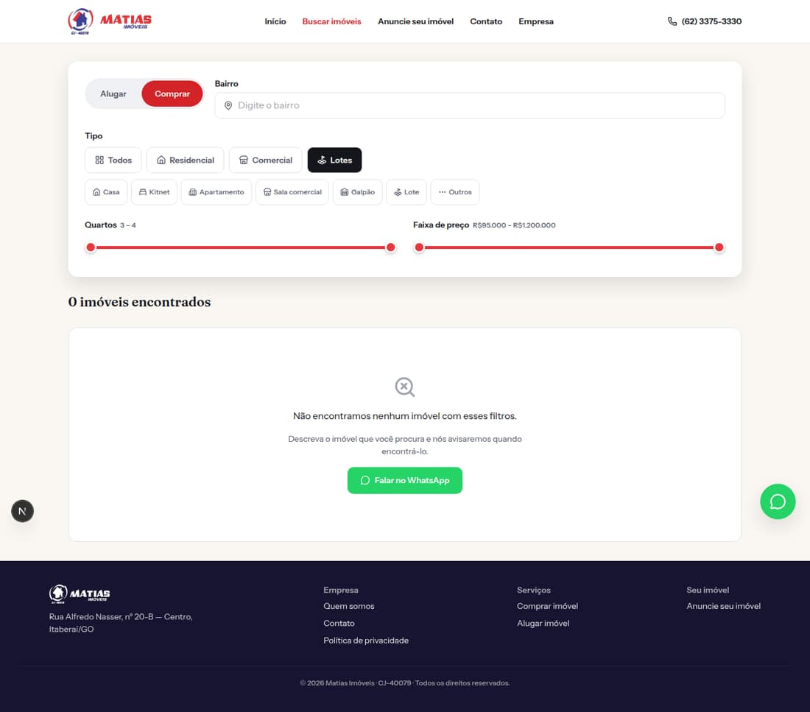 Comprar + Lotes = 0 (existe um lote à venda) |
| 04 | 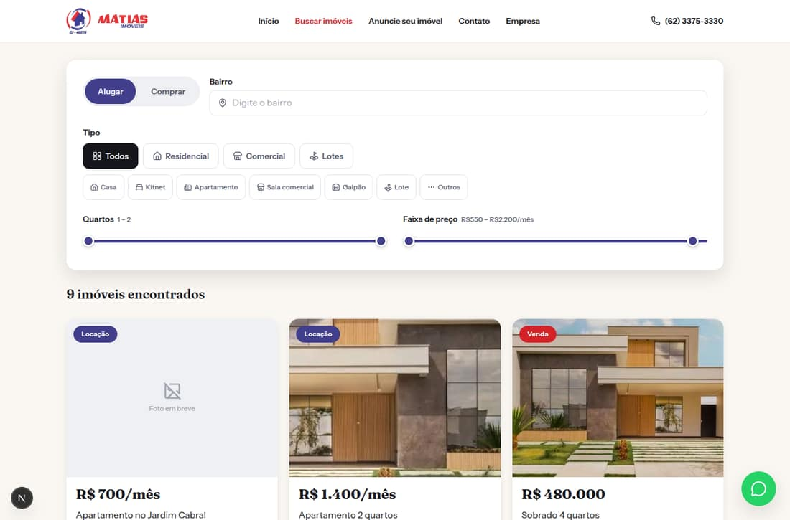 "Alugar" marcado, mas a lista inclui imóveis à venda |
| 05 | 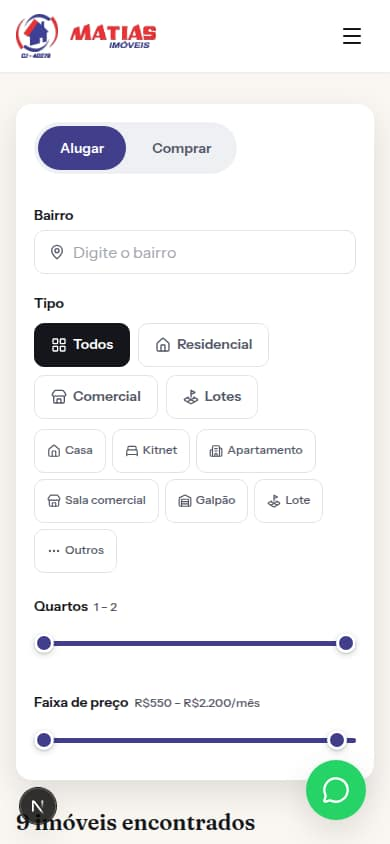 `/imoveis` no celular: a 1ª tela inteira é filtro |
| 06 |  Ficha no celular: características estourando a largura |
| 07 | 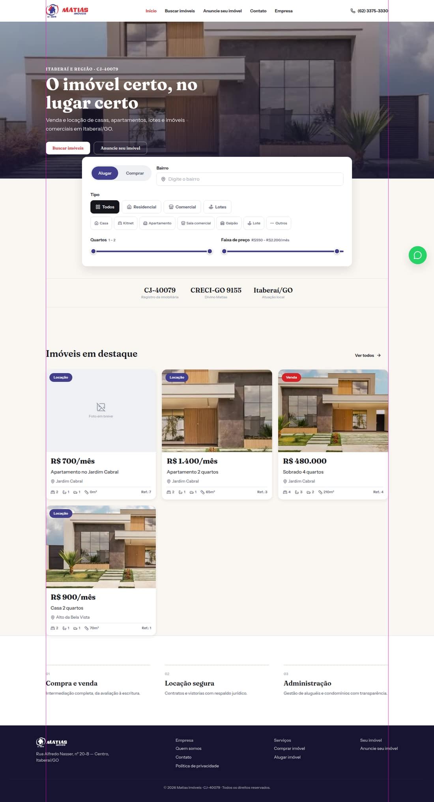 Home com linhas-guia nas bordas do container |
| 08 | 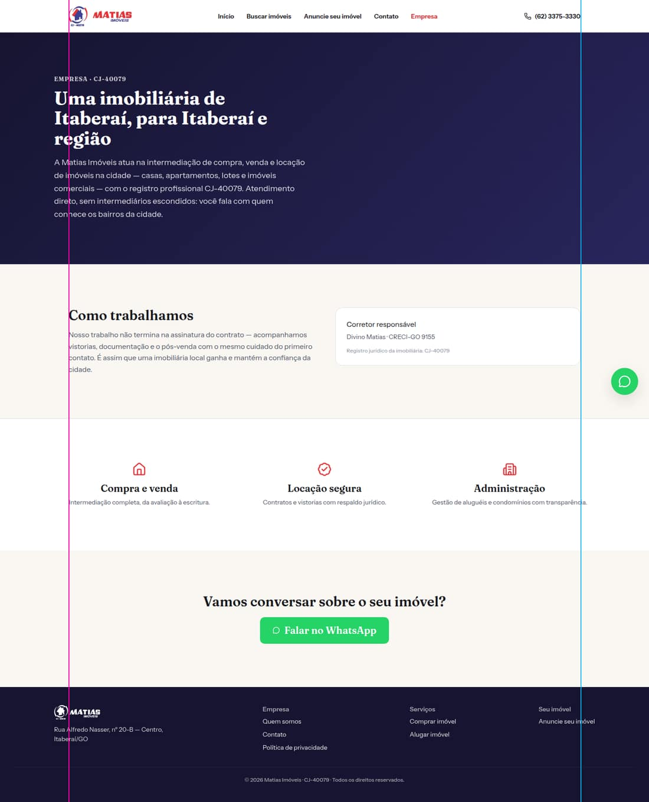 Empresa: topo e rodapé 32px fora da guia rosa; textos passando da guia azul |
| 09 | 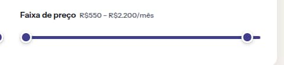 Bolinha do preço máximo parada antes do fim da barra |
| 10 | 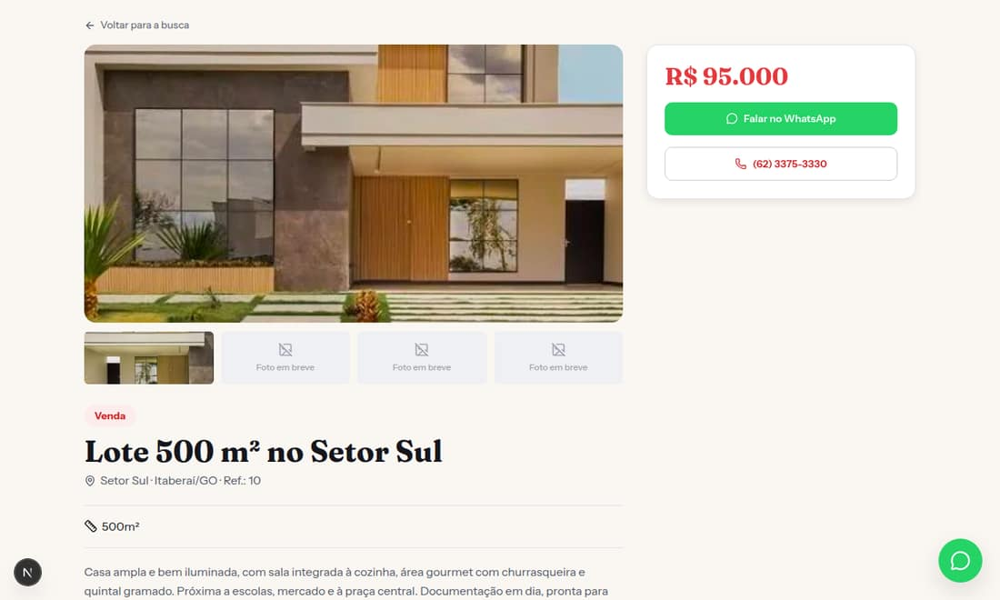 Lote com 2 fotos: 3 quadros falsos de "Foto em breve" (foto de teste) |
| 11 | 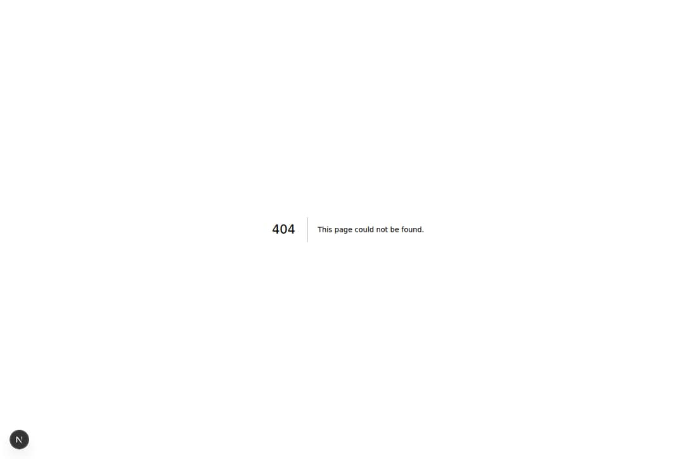 404 sem menu e em inglês |
| 12 | 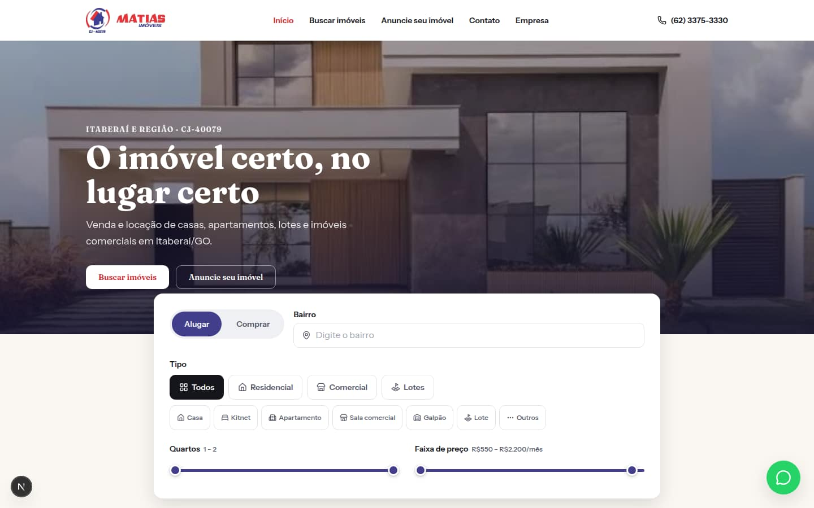 Primeira tela da Home no desktop (foto borrada, card de busca recuado) |
| 13 |  Home inteira no celular com os 4 anúncios reais (sem fotos) |
